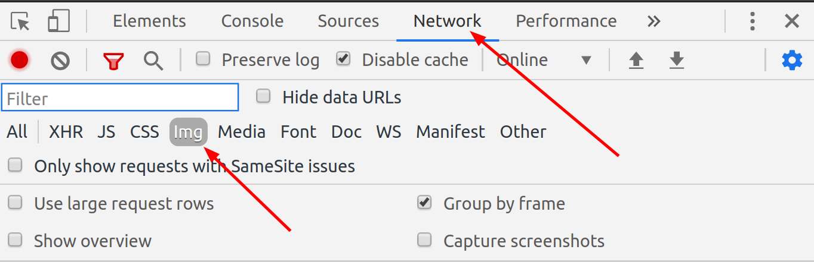
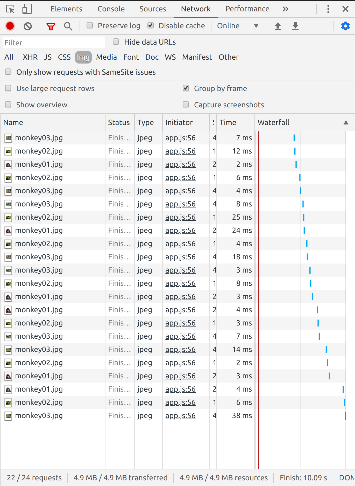
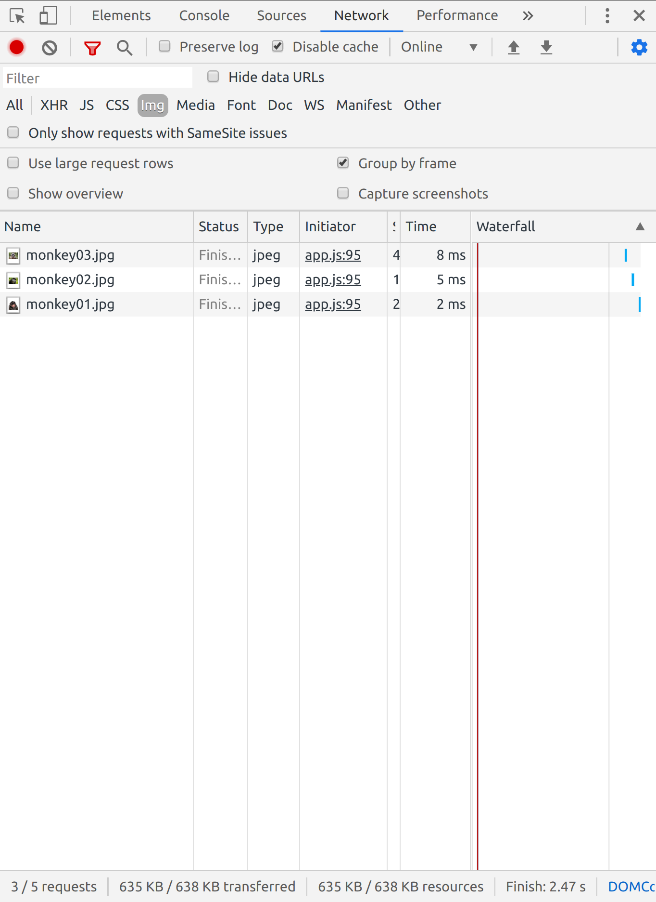

# JS alternative image load example
This example, derived from a help request, illustrates the difference between the usual image manipulation schema versus a more verbose, slightly more load-efficient architecture.

#### Important note:
Due to **browser cache**, this example might very well be useless for simple projects. Still it might increase page response by some measurements in image-heavy projects. All still pending some serious test/review.

Pardon the lack of style, it's irrelevant to the matter at hand.

All the relevant code is at `app.js`.

## Main difference
"Basic" version event callback simply replaces `img.src`, which always triggers a new load from the server/browser cache.

"Premium" version (😅) will store the new `Image` object on load and inject it into the wrapper when requested, directly from memory.

To visually test the difference, follow these steps:
- Download the code and open `index.html` in browser (Chrome ideally).
- Open Chrome dev tools, open the "Network" tab and select "Img".



- Leave the optional flags as they are for the first iteration:

```javascript
// #### Configuration variables ####

// Toggle between image load versions.
let useEfficientLoad = false;
// Trigger eager load of all images on app initialization.
let eagerLoad = false;
```

- The code will create a simple list. Upon "hover" javascript will inject a different image on the dome.
___
### 1. Basic mode (non-efficient)
Although we only have 3 images, the Img screen in the Chrome inspector will quickly fill with image loads as we pass the cursor over the top list:



### 2. Efficient mode
In this version, the images will load only once: after that they'll be pulled from memory, not from a new load event.

Change the option value:
```javascript
let useEfficientLoad = true;
```

Reload the page and check the Img screen: only 3 image load events will happen, no matter the times we hover on the list:



Load time might seem tiny, but is not nothing.